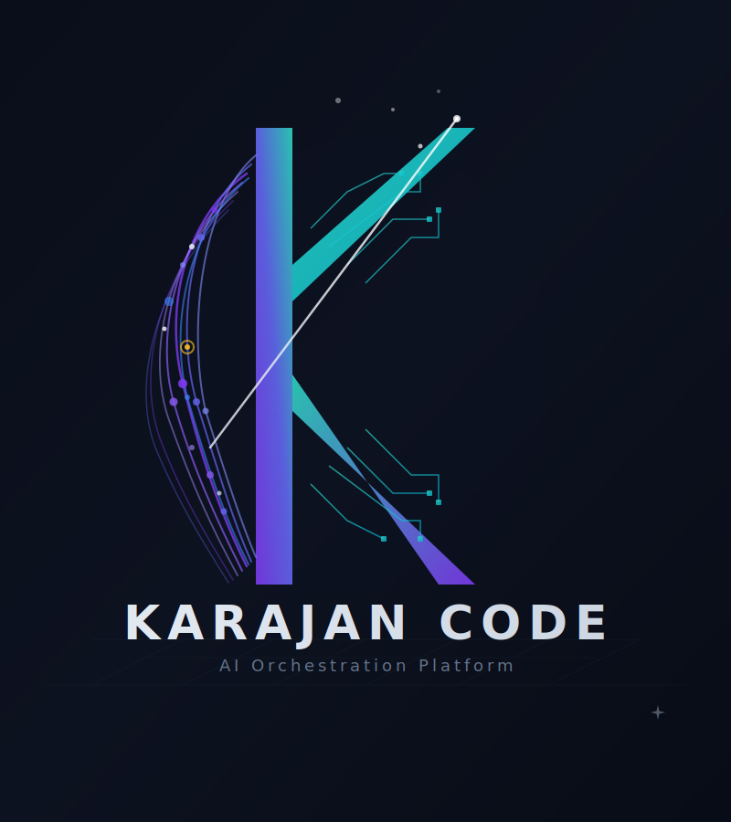

<p align="center">
  
</p>

<h1 align="center">Karajan Code</h1>

<p align="center">
  Local multi-agent coding orchestrator. TDD-first, MCP-based, vanilla JavaScript.
</p>

<p align="center">
  <a href="https://www.npmjs.com/package/karajan-code"></a>
  <a href="https://www.npmjs.com/package/karajan-code"></a>
  <a href="https://github.com/manufosela/karajan-code/actions"></a>
  <a href="https://www.gnu.org/licenses/agpl-3.0"></a>
  <a href="https://nodejs.org"></a>
</p>

<p align="center">
  <a href="docs/README.es.md">Leer en Español</a> · <a href="https://karajancode.com">Documentation</a>
</p>

---

You describe what you want to build. Karajan orchestrates multiple AI agents to plan it, implement it, test it, review it with SonarQube, and iterate. No babysitting required.

## What is Karajan?

Karajan is a local coding orchestrator. It runs on your machine, uses your existing AI providers (Claude, Codex, Gemini, Aider, OpenCode), and coordinates a pipeline of specialized agents that work together on your code.

It is not a hosted service. It is not a VS Code extension. It is a tool you install once and use from the terminal or as an MCP server inside your AI agent.

The name comes from Herbert von Karajan, the conductor who believed that the best orchestras are made of great independent musicians who know exactly when to play and when to listen. Same idea, applied to AI agents.

## Why not just use Claude Code?

Claude Code is excellent. Use it for interactive, session-based coding.

Use Karajan when you want:

- **A repeatable, documented pipeline** that runs the same way every time
- **TDD by default.** Tests are written before implementation, not after
- **SonarQube integration.** Code quality gates as part of the flow, not an afterthought
- **Solomon as pipeline boss.** Every reviewer rejection is evaluated by a supervisor that decides if it's valid or just style noise
- **Multi-provider routing.** Claude as coder, Codex as reviewer, or any combination
- **Zero-config operation.** Auto-detects test frameworks, starts SonarQube, simplifies pipeline for trivial tasks
- **Composable role architecture.** Agent behaviors defined as plain markdown files that travel with your project
- **Local-first.** Your code, your keys, your machine. No data leaves unless you say so
- **Zero API costs.** Karajan uses AI agent CLIs (Claude Code, Codex, Gemini CLI), not APIs. You pay your existing subscription (Claude Pro, ChatGPT Plus), not per-token API fees

If Claude Code is a smart pair programmer, Karajan is the CI/CD pipeline for AI-assisted development. They work great together: Karajan is designed to be used as an MCP server inside Claude Code.

## Install

```bash
npm install -g karajan-code
```

That's it. No Docker required (SonarQube uses Docker, but Karajan auto-manages it). No config files to copy. `kj init` auto-detects your installed agents.

## Three ways to use Karajan

Karajan installs **three commands**: `kj`, `kj-tail`, and `karajan-mcp`.

### 1. CLI: direct from terminal

Run Karajan directly. You see the full pipeline output in real time.

```bash
kj run "Create a utility function that validates Spanish DNI numbers, with tests"
kj code "Add input validation to the signup form"     # Coder only
kj review "Check the authentication changes"           # Review current diff
kj audit "Full health analysis of this codebase"       # Read-only audit
kj plan "Refactor the database layer"                  # Plan without coding
```

### 2. MCP: inside your AI agent

This is the primary use case. Karajan runs as an MCP server inside Claude Code, Codex, or Gemini. You ask your AI agent to do something, and it delegates the heavy lifting to Karajan's pipeline.

```
You → Claude Code → kj_run (via MCP) → triage → coder → sonar → reviewer → tester → security
```

The MCP server auto-registers during `npm install`. Your AI agent sees 20 tools (`kj_run`, `kj_code`, `kj_review`, etc.) and uses them as needed.

**The problem**: when Karajan runs inside an AI agent, you lose visibility. The agent shows you the final result, but not the pipeline stages, iterations, or Solomon decisions happening in real time.

### 3. kj-tail: monitor from a separate terminal

**This is the companion tool.** Open a second terminal in the **same project directory** where your AI agent is working, and run:

```bash
kj-tail
```

You'll see the live pipeline output (stages, results, iterations, errors) as they happen. Same view as running `kj run` directly.

```
kj-tail                  # Follow pipeline in real time (default)
kj-tail -v               # Verbose: include agent heartbeats and budget
kj-tail -t               # Show timestamps
kj-tail -s               # Snapshot: show current log and exit
kj-tail -n 50            # Show last 50 lines then follow
kj-tail --help           # Full options
```

> **Important**: `kj-tail` must run from the same directory where the AI agent is executing. It reads `<project>/.kj/run.log`, which is created when Karajan starts a pipeline via MCP.

**Typical workflow:**

```
┌─────────────────────────┐    ┌─────────────────────────┐
│  Terminal 1              │    │  Terminal 2              │
│                          │    │                          │
│  $ claude                │    │  $ kj-tail               │
│  > implement the next    │    │                          │
│    priority task         │    │  ├─ 📋 Triage: medium    │
│                          │    │  ├─ 🔬 Researcher ✅     │
│  (Claude calls kj_run   │    │  ├─ 🧠 Planner ✅        │
│   via MCP, you see       │    │  ├─ 🔨 Coder ✅          │
│   only the final result) │    │  ├─ 🔍 Sonar: OK        │
│                          │    │  ├─ 👁️ Reviewer ❌       │
│                          │    │  ├─ ⚖️ Solomon: 2 cond.  │
│                          │    │  ├─ 🔨 Coder (iter 2) ✅ │
│                          │    │  ├─ ✅ Review: APPROVED   │
│                          │    │  ├─ 🧪 Tester: passed    │
│                          │    │  └─ 🏁 Result: APPROVED  │
└─────────────────────────┘    └─────────────────────────┘
```

**Full pipeline example**, a complex task with all roles:

```
┌─ Terminal 1 ─────────────────────────────────────────────────────────────────┐
│                                                                              │
│  $ claude                                                                    │
│                                                                              │
│  > Build a REST API for a booking system. Requirements:                      │
│  > - Express + TypeScript with Zod validation on every endpoint              │
│  > - Endpoints: POST /bookings, GET /bookings/:id, PATCH /bookings/:id/cancel│
│  > - A booking has: id, guestName, roomType (standard|suite|penthouse),      │
│  >   checkIn, checkOut, status (confirmed|cancelled)                         │
│  > - Validate: checkOut must be after checkIn, no past dates,                │
│  >   roomType must be a valid enum value                                     │
│  > - Cancel returns 409 if already cancelled                                 │
│  > - Use TDD. Run it through Karajan with architect and planner enabled,     │
│  >   paranoid review mode. Coder claude, reviewer codex.                     │
│                                                                              │
│  Claude calls kj_run via MCP with:                                           │
│    --enable-architect --enable-researcher --enable-planner --mode paranoid    │
│                                                                              │
└──────────────────────────────────────────────────────────────────────────────┘

┌─ Terminal 2: kj-tail ────────────────────────────────────────────────────────┐
│                                                                              │
│  kj-tail v1.38.0 — .kj/run.log                                              │
│                                                                              │
│  ├─ 📋 Triage: medium (sw) — enabling researcher, architect, planner         │
│  ├─ ⚙️ Preflight passed — all checks OK                                     │
│  ├─ 🔬 Researcher: 8 files analyzed, 3 patterns, 5 constraints              │
│  ├─ 🏗️ Architect: 3-layer design (routes → service → validators)            │
│  ├─ 🧠 Planner: 6 steps — tests first, then routes, service, validators     │
│  │                                                                           │
│  ▶ Iteration 1/5                                                             │
│  ├─ 🔨 Coder (claude): implemented 3 endpoints + 18 tests                   │
│  ├─ 📋 TDD: PASS (3 src, 2 test files)                                      │
│  ├─ 🔍 Sonar: Quality gate OK — 0 blockers                                  │
│  ├─ 👁️ Reviewer (codex): REJECTED (2 blocking)                              │
│  │   "Missing 404 for GET nonexistent booking"                               │
│  │   "Cancel endpoint lacks idempotency test"                                │
│  ├─ ⚖️ Solomon: approve_with_conditions (2 conditions)                      │
│  │   "Add 404 response and test for GET /bookings/:id with unknown id"       │
│  │   "Add test: cancel already-cancelled booking returns 409, not 500"       │
│  │                                                                           │
│  ▶ Iteration 2/5                                                             │
│  ├─ 🔨 Coder (claude): fixed — 22 tests now                                 │
│  ├─ 📋 TDD: PASS                                                            │
│  ├─ 🔍 Sonar: OK                                                            │
│  ├─ 👁️ Reviewer (codex): APPROVED                                           │
│  ├─ 🧪 Tester: passed — coverage 94%, 22 tests                              │
│  ├─ 🔒 Security: passed — 0 critical, 1 low (helmet recommended)            │
│  ├─ 📊 Audit: CERTIFIED (with 3 advisory warnings)                          │
│  │                                                                           │
│  🏁 Result: APPROVED                                                         │
│     🔬 Research: 8 files, 3 patterns identified                              │
│     🗺 Plan: 6 steps (tests first)                                           │
│     🧪 Coverage: 94%, 22 tests                                               │
│     🔒 Security: passed                                                      │
│     🔍 Sonar: OK                                                             │
│     💰 Budget: $0.42 (claude: $0.38, codex: $0.04)                           │
│                                                                              │
└──────────────────────────────────────────────────────────────────────────────┘
```

[**Watch the full pipeline demo**](https://karajancode.com#demo): triage, architecture, TDD, SonarQube, code review, Solomon arbitration, security audit.

## The pipeline

```
hu-reviewer? → triage → discover? → architect? → planner? → coder → sonar? → impeccable? → reviewer → tester? → security? → solomon → commiter?
```

**15 roles**, each executed by the AI agent you choose:

| Role | What it does | Default |
|------|-------------|---------|
| **hu-reviewer** | Certifies user stories before coding (6 dimensions, 7 antipatterns) | Auto (medium/complex) |
| **triage** | Classifies complexity, activates roles, auto-simplifies for trivial tasks | **On** |
| **discover** | Detects gaps in requirements (Mom Test, Wendel, JTBD) | Off |
| **architect** | Designs solution architecture before planning | Off |
| **planner** | Generates structured implementation plans | Off |
| **coder** | Writes code and tests following TDD methodology | **Always on** |
| **refactorer** | Improves code clarity without changing behavior | Off |
| **sonar** | SonarQube static analysis with quality gate enforcement | On (auto-managed) |
| **impeccable** | UI/UX audit for frontend tasks (a11y, performance, theming) | Auto (frontend) |
| **reviewer** | Code review with configurable strictness profiles | **Always on** |
| **tester** | Test quality gate and coverage verification | **On** |
| **security** | OWASP security audit | **On** |
| **solomon** | Pipeline boss: evaluates every rejection, overrides style-only blocks | **On** |
| **commiter** | Git commit, push, and PR automation after approval | Off |
| **audit** | Read-only codebase health analysis (5 dimensions, A-F scores) | Standalone |

## 5 AI agents supported

| Agent | CLI | Install |
|-------|-----|---------|
| **Claude** | `claude` | `npm install -g @anthropic-ai/claude-code` |
| **Codex** | `codex` | `npm install -g @openai/codex` |
| **Gemini** | `gemini` | See [Gemini CLI docs](https://github.com/google-gemini/gemini-cli) |
| **Aider** | `aider` | `pipx install aider-chat` (or `pip3 install aider-chat`) |
| **OpenCode** | `opencode` | See [OpenCode docs](https://github.com/nicepkg/opencode) |

Mix and match. Use Claude as coder and Codex as reviewer. Karajan auto-detects installed agents during `kj init`.

## MCP server (20 tools)

After `npm install -g karajan-code`, the MCP server auto-registers in Claude and Codex. Manual config if needed:

```bash
# Claude: add to ~/.claude.json → "mcpServers":
# { "karajan-mcp": { "command": "karajan-mcp" } }

# Codex: add to ~/.codex/config.toml → [mcp_servers."karajan-mcp"]
# command = "karajan-mcp"
```

**20 tools** available: `kj_run`, `kj_code`, `kj_review`, `kj_plan`, `kj_audit`, `kj_scan`, `kj_doctor`, `kj_config`, `kj_report`, `kj_resume`, `kj_roles`, `kj_agents`, `kj_preflight`, `kj_status`, `kj_init`, `kj_discover`, `kj_triage`, `kj_researcher`, `kj_architect`, `kj_impeccable`.

Use `kj-tail` in a separate terminal to see what the pipeline is doing in real time (see [Three ways to use Karajan](#three-ways-to-use-karajan)).

## The role architecture

Every role in Karajan is defined by a markdown file: a plain document that describes how the agent should behave, what to check, and what good output looks like.

```
.karajan/roles/         # Project overrides (optional)
~/.karajan/roles/       # Global overrides (optional)
templates/roles/        # Built-in defaults (shipped with package)
```

You can override any built-in role or create new ones. No code required. The agents read the role files and adapt their behavior. Encode your team's conventions, domain rules, and quality standards, and every run of Karajan applies them automatically.

Use `kj roles show <role>` to inspect any template.

## Zero-config by design

Karajan auto-detects and auto-configures everything it can:

- **TDD**: Detects test framework (vitest, jest, mocha) → auto-enables TDD
- **Bootstrap gate**: Validates all prerequisites (git repo, remote, config, agents, SonarQube) before any tool runs. Fails hard with actionable fix instructions, never silently degrades
- **Injection guard**: Scans diffs for prompt injection before AI review. Detects directive overrides, invisible Unicode, oversized comment payloads. Also runs as a GitHub Action on every PR
- **SonarQube**: Auto-starts Docker container, generates config if missing
- **Pipeline complexity**: Triage classifies task → trivial tasks skip reviewer loop
- **Provider outages**: Retries on 500/502/503/504 with backoff (same as rate limits)
- **Coverage**: Coverage-only quality gate failures treated as advisory
- **HU Manager**: Complex tasks auto-decompose into formal user stories with dependencies. Each HU runs as its own sub-pipeline with state tracking visible in the HU Board

No per-project configuration required. If you want to customize, config is layered: session > project > global.

## Why vanilla JavaScript?

Not nostalgia, not stubbornness. I've been using JavaScript since 1997, when Brendan Eich created it in a week and changed the lives of everyone building for the web. I know its guts, its bugs, its quirks. And I know that whoever truly understands JS turns those bugs into features. TypeScript exists so that developers used to strongly-typed languages don't panic when they see JS. I respect that. But I don't need it. Tests are my type safety. JSDoc and a good IDE are my intellisense. And not having a compiler between the code and me is what lets me ship 57 releases in 45 days without fear.

[Why vanilla JavaScript: the long version](docs/why-vanilla-js.md)

## Recommended companions

| Tool | Why |
|------|-----|
| [**RTK**](https://github.com/rtk-ai/rtk) | Reduces token consumption by 60-90% on Bash command outputs |
| [**Planning Game MCP**](https://github.com/AgenteIA-Geniova/planning-game-mcp) | Agile project management (tasks, sprints, estimation), XP-native |
| [**GitHub MCP**](https://github.com/modelcontextprotocol/servers/tree/main/src/github) | Create PRs, manage issues directly from the agent |
| [**Chrome DevTools MCP**](https://github.com/anthropics/anthropic-quickstarts/tree/main/chrome-devtools-mcp) | Verify UI changes visually after frontend modifications |

## Contributing

```bash
git clone https://github.com/manufosela/karajan-code.git
cd karajan-code
npm install
npm test              # Run 2093 tests with Vitest
npm run validate      # Lint + test
```

Issues and pull requests welcome. If something doesn't work as documented, [open an issue](https://github.com/manufosela/karajan-code/issues). That's the most useful contribution at this stage.

## Links

- [Website](https://karajancode.com) (also [kj-code.com](https://kj-code.com))
- [Full documentation](https://karajancode.com/docs/)
- [Changelog](CHANGELOG.md)
- [Security Policy](SECURITY.md)
- [License (AGPL-3.0)](LICENSE)

---

Built by [@manufosela](https://github.com/manufosela). Head of Engineering at Geniova Technologies, co-organizer of NodeJS Madrid, author of [Liderazgo Afectivo](https://www.liderazgoafectivo.com). 90+ npm packages published.
