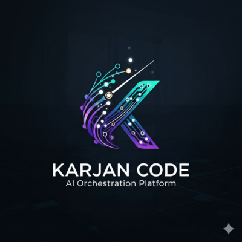

<p align="center">
  
</p>

<h1 align="center">Karajan Code</h1>

<p align="center">
  Local multi-agent coding orchestrator. TDD-first, MCP-based, vanilla JavaScript.
</p>

<p align="center">
  <a href="https://www.npmjs.com/package/karajan-code"></a>
  <a href="https://www.npmjs.com/package/karajan-code"></a>
  <a href="https://github.com/manufosela/karajan-code/actions"></a>
  <a href="https://www.gnu.org/licenses/agpl-3.0"></a>
  <a href="https://nodejs.org"></a>
</p>

<p align="center">
  <a href="docs/README.es.md">Leer en Español</a> · <a href="https://karajancode.com">Documentation</a>
</p>

---

You describe what you want to build. Karajan orchestrates multiple AI agents to plan it, implement it, test it, review it with SonarQube, and iterate — without you babysitting every step.

## What is Karajan?

Karajan is a local coding orchestrator. It runs on your machine, uses your existing AI providers (Claude, Codex, Gemini, Aider, OpenCode), and coordinates a pipeline of specialized agents that work together on your code.

It is not a hosted service. It is not a VS Code extension. It is a tool you install once and use from the terminal or as an MCP server inside your AI agent.

The name comes from Herbert von Karajan — the conductor who believed that the best orchestras are made of great independent musicians who know exactly when to play and when to listen. Same idea here, applied to AI agents.

## Why not just use Claude Code?

Claude Code is excellent. Use it for interactive, session-based coding.

Use Karajan when you want:

- **A repeatable, documented pipeline** that runs the same way every time
- **TDD by default** — tests are written before implementation, not after
- **SonarQube integration** — code quality gates as part of the flow, not an afterthought
- **Solomon as pipeline boss** — every reviewer rejection is evaluated by a supervisor that decides if it's valid or just style noise
- **Multi-provider routing** — Claude as coder, Codex as reviewer, or any combination
- **Zero-config operation** — auto-detects test frameworks, starts SonarQube, simplifies pipeline for trivial tasks
- **Composable role architecture** — define agent behaviors as plain markdown files that travel with your project
- **Local-first** — your code, your keys, your machine, no data leaves unless you say so

If Claude Code is a smart pair programmer, Karajan is the CI/CD pipeline for AI-assisted development. They work great together — Karajan is designed to be used as an MCP server inside Claude Code.

## Install

```bash
npm install -g karajan-code
```

That's it. No Docker required (SonarQube uses Docker, but Karajan auto-manages it). No config files to copy. `kj init` auto-detects your installed agents.

## Quick start

```bash
# Run a task — Karajan handles the rest
kj run "Create a utility function that validates Spanish DNI numbers, with tests"
```

[**▶ Watch the full pipeline demo**](https://karajancode.com#demo) — HU certification, triage, architecture, TDD, SonarQube, code review, Solomon arbitration, security audit.

Karajan will:
1. Triage the task complexity and activate the right roles
2. Write tests first (TDD)
3. Implement code to pass those tests
4. Run SonarQube analysis (auto-starts Docker if needed)
5. Review the code (Solomon evaluates every rejection)
6. Iterate until approved or escalate to you

```bash
# More examples
kj code "Add input validation to the signup form"     # Coder only
kj review "Check the authentication changes"           # Review current diff
kj audit "Full health analysis of this codebase"       # Read-only audit
kj plan "Refactor the database layer"                  # Plan without coding
```

## The pipeline

```
hu-reviewer? → triage → discover? → architect? → planner? → coder → sonar? → impeccable? → reviewer → tester? → security? → solomon → commiter?
```

**15 roles**, each executed by the AI agent you choose:

| Role | What it does | Default |
|------|-------------|---------|
| **hu-reviewer** | Certifies user stories before coding (6 dimensions, 7 antipatterns) | Off |
| **triage** | Classifies complexity, activates roles, auto-simplifies for trivial tasks | **On** |
| **discover** | Detects gaps in requirements (Mom Test, Wendel, JTBD) | Off |
| **architect** | Designs solution architecture before planning | Off |
| **planner** | Generates structured implementation plans | Off |
| **coder** | Writes code and tests following TDD methodology | **Always on** |
| **refactorer** | Improves code clarity without changing behavior | Off |
| **sonar** | SonarQube static analysis with quality gate enforcement | On (auto-managed) |
| **impeccable** | UI/UX audit for frontend tasks (a11y, performance, theming) | Auto (frontend) |
| **reviewer** | Code review with configurable strictness profiles | **Always on** |
| **tester** | Test quality gate and coverage verification | **On** |
| **security** | OWASP security audit | **On** |
| **solomon** | Pipeline boss — evaluates every rejection, overrides style-only blocks | **On** |
| **commiter** | Git commit, push, and PR automation after approval | Off |
| **audit** | Read-only codebase health analysis (5 dimensions, A-F scores) | Standalone |

## 5 AI agents supported

| Agent | CLI | Install |
|-------|-----|---------|
| **Claude** | `claude` | `npm install -g @anthropic-ai/claude-code` |
| **Codex** | `codex` | `npm install -g @openai/codex` |
| **Gemini** | `gemini` | See [Gemini CLI docs](https://github.com/google-gemini/gemini-cli) |
| **Aider** | `aider` | `pip install aider-chat` |
| **OpenCode** | `opencode` | See [OpenCode docs](https://github.com/nicepkg/opencode) |

Mix and match. Use Claude as coder and Codex as reviewer. Karajan auto-detects installed agents during `kj init`.

## MCP server — 20 tools

Karajan is designed to be used as an MCP server inside your AI agent. After install, it auto-registers in Claude and Codex:

```bash
# Already done by npm install, but manual config if needed:
# Add to ~/.claude.json → "mcpServers":
# { "karajan-mcp": { "command": "karajan-mcp" } }
```

**20 tools** available: `kj_run`, `kj_code`, `kj_review`, `kj_plan`, `kj_audit`, `kj_scan`, `kj_doctor`, `kj_config`, `kj_report`, `kj_resume`, `kj_roles`, `kj_agents`, `kj_preflight`, `kj_status`, `kj_init`, `kj_discover`, `kj_triage`, `kj_researcher`, `kj_architect`, `kj_impeccable`.

## The role architecture

Every role in Karajan is defined by a markdown file — a plain document that describes how the agent should behave, what to check, and what good output looks like.

```
.karajan/roles/         # Project overrides (optional)
~/.karajan/roles/       # Global overrides (optional)
templates/roles/        # Built-in defaults (shipped with package)
```

You can override any built-in role or create new ones. No code required. The agents read the role files and adapt their behavior. This means you can encode your team's conventions, domain rules, and quality standards — and every run of Karajan will apply them automatically.

Use `kj roles show <role>` to inspect any template.

## Zero-config by design

Karajan auto-detects and auto-configures everything it can:

- **TDD**: Detects test framework (vitest, jest, mocha) → auto-enables TDD
- **SonarQube**: Auto-starts Docker container, generates config if missing
- **Pipeline complexity**: Triage classifies task → trivial tasks skip reviewer loop
- **Provider outages**: Retries on 500/502/503/504 with backoff (same as rate limits)
- **Coverage**: Coverage-only quality gate failures treated as advisory

No per-project configuration required. If you want to customize, config is layered: session > project > global.

## Why vanilla JavaScript?

Because it should be.

Karajan has **1847 tests** across 149 files. It runs on Node.js without a build step. You can read the source, understand it, fork it, and modify it without a TypeScript compiler between you and the code.

This is a deliberate choice, not a limitation. The tests are the type safety. The legibility is a feature. **52 releases in 23 days** — that velocity is possible precisely because vanilla JS with good tests lets you move fast without fear.

## Recommended companions

| Tool | Why |
|------|-----|
| [**RTK**](https://github.com/rtk-ai/rtk) | Reduces token consumption by 60-90% on Bash command outputs |
| [**Planning Game MCP**](https://github.com/AgenteIA-Geniova/planning-game-mcp) | Agile project management (tasks, sprints, estimation) — XP-native |
| [**GitHub MCP**](https://github.com/modelcontextprotocol/servers/tree/main/src/github) | Create PRs, manage issues directly from the agent |
| [**Chrome DevTools MCP**](https://github.com/anthropics/anthropic-quickstarts/tree/main/chrome-devtools-mcp) | Verify UI changes visually after frontend modifications |

## Contributing

```bash
git clone https://github.com/manufosela/karajan-code.git
cd karajan-code
npm install
npm test              # Run 1847 tests with Vitest
npm run validate      # Lint + test
```

Issues and pull requests welcome. If something doesn't work as documented, [open an issue](https://github.com/manufosela/karajan-code/issues) — that's the most useful contribution at this stage.

## Links

- [Website](https://karajancode.com) (also [kj-code.com](https://kj-code.com))
- [Full documentation](https://karajancode.com/docs/)
- [Changelog](CHANGELOG.md)
- [Security Policy](SECURITY.md)
- [License (AGPL-3.0)](LICENSE)

---

Built by [@manufosela](https://github.com/manufosela) — Head of Engineering at Geniova Technologies, co-organizer of NodeJS Madrid, author of [Liderazgo Afectivo](https://www.amazon.es/dp/B0D7F4C8KC). 90+ npm packages published.
